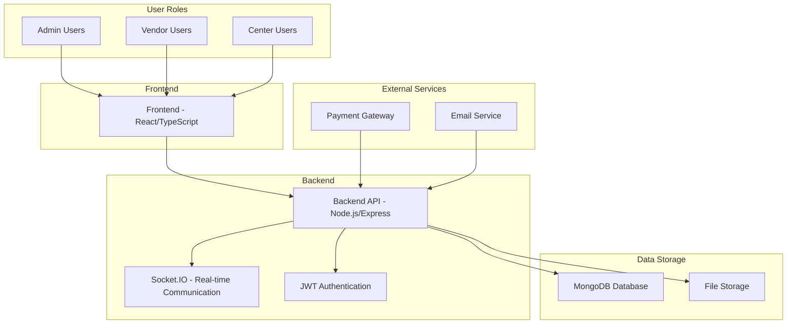

# Vendor Request System (VRS) - Architectural Overview

## System Components

## Key Features

1. **User Management**
   - Role-based access control (Admin, Vendor, Center)
   - Authentication and authorization
   - User profile management

2. **Product Management**
   - Product catalog with categories
   - Multi-center availability tracking
   - Stock management

3. **Order Management**
   - Complete order lifecycle
   - Status tracking
   - Payment processing

4. **Real-time Communication**
   - Chat system between vendors and centers
   - Order update notifications
   - Online status indicators

5. **Admin Dashboard**
   - Vendor application review
   - System analytics and reporting
   - Center management

## Technology Stack

- **Frontend**: React, TypeScript, Tailwind CSS
- **Backend**: Node.js, Express.js
- **Database**: MongoDB
- **Real-time**: Socket.IO
- **Authentication**: JWT
- **File Storage**: Local/Multer
- **Payment Processing**: Stripe
- **Email Service**: Nodemailer